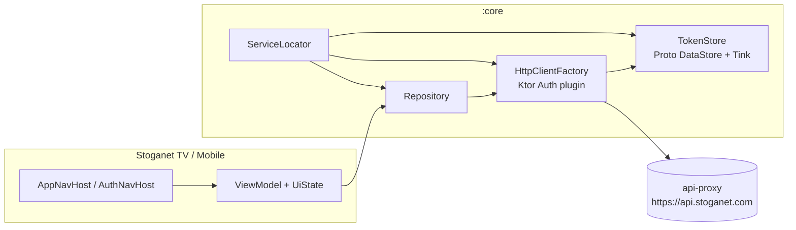

# Stoganet Android Client

Native Android clients for the Stoganet ecosystem. Kotlin + Compose. Talks exclusively to [api-proxy](https://github.com/Stoganet/api-proxy) — never directly to Jellyfin.

Licensed under [MIT](./LICENSE).

## Modules

- **`:core`** — data layer, `ServiceLocator` DI, generated OpenAPI client. No UI framework dependencies. Consumed by both apps below.
- **`:tv`** (`com.stoganet.tv`) — Android TV app, Compose-for-TV. Shipping today.
- **`:mobile`** (`com.stoganet.mobile`) — phone/tablet app, standard Material3. Placeholder screen only; real screens are a separate follow-up.

`:tv` and `:mobile` are separate installable apps with separate `applicationId`s and manifests — `:tv` requires the Leanback launcher category and `android.software.leanback` feature, `:mobile` doesn't. Neither depends on the other.

## Architecture at a glance



**Single Ktor `HttpClient`, one base URL:** the `Auth` plugin attaches `Authorization: Bearer` from `TokenStore` and handles 401 → refresh → retry automatically. `refreshTokens` marks its own request with `markAsRefreshTokenRequest()` so a 401 on the refresh call itself doesn't trigger another refresh. The same client instance is reused by Coil for image loading in `:tv`.

**Two NavHosts (`:tv` only):**

- `AuthNavHost` — shown when no valid tokens exist. Quick Connect screen today.
- `AppNavHost` — shown after authentication. Home screen (placeholder) today.

`MainActivity` decides which NavHost to show based on `TokenStore`. `:mobile` has no navigation graph yet.

## Screens (`:tv`)

| Screen | Status | NavHost |
|--------|--------|---------|
| Quick Connect | ✅ | Auth |
| Home / Browse | 🔜 | App |
| Catalog detail | 🔜 | App |
| Search | 🔜 | App |

## API client

Generated from `openapi/openapi.yaml` (a copy of the spec from `api-proxy`) into `:core`, package `com.stoganet.core.api`. Run `./gradlew :core:openApiGenerate` after updating the spec. Generated code lands in `core/build/generated/openapi/` — never edit by hand.

## Build & run

```bash
./gradlew :tv:installDebug                  # build debug and install to connected TV device/emulator
./gradlew :mobile:installDebug              # build debug and install to connected phone/emulator
./gradlew :core:testDebugUnitTest :tv:testDebugUnitTest   # unit tests
./gradlew detekt                            # lint
./gradlew detekt --auto-correct             # lint + auto-fix
./gradlew :core:openApiGenerate             # regenerate Kotlin client from openapi/openapi.yaml
./gradlew :tv:assembleRelease               # release APK (requires signing config)
```

Run a single test class:

```bash
./gradlew :tv:testDebugUnitTest --tests "com.stoganet.tv.ui.auth.QuickConnectViewModelTest"
./gradlew :core:testDebugUnitTest --tests "com.stoganet.core.data.auth.TokenStoreTest"
```

## Repository layout

| Path | What's there |
|------|-------------|
| `openapi/openapi.yaml` | API spec (copy from `api-proxy`) — source of truth for client generation |
| `core/build/generated/openapi/` | Generated Kotlin client and models — do not edit |
| `core/src/main/kotlin/.../data/` | `TokenStore`, `HttpClientFactory`, repositories |
| `core/src/main/kotlin/.../di/` | `ServiceLocator` — manual DI wiring, shared by `:tv` and `:mobile` |
| `core/consumer-rules.pro` | R8 keep rules for `:core` types, merged automatically into consumers |
| `core/src/main/proto/` | Proto DataStore schema for encrypted token storage |
| `tv/src/main/kotlin/.../ui/` | NavHosts, screens, ViewModels, UiState, Intent types |
| `tv/src/main/res/` | Strings, drawables, TV banner |
| `mobile/src/main/kotlin/.../` | Mobile app entry point |

## Environment

No runtime environment variables. Base URL is hardcoded to `https://api.stoganet.com` in `HttpClientFactory`. Debug builds append `.debug` to `applicationId` and enable HTTP logging (headers only — no body).
